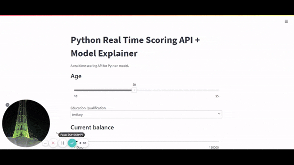
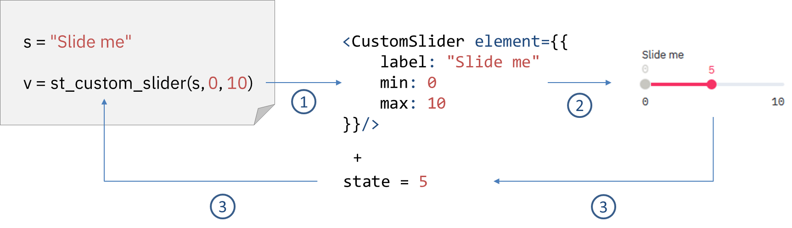

# Streamlit Custom Components

An App where we load react components into streamlit. The data can be received and passed to these react components. We also integrated Flask API to make our requests allowing us to utilize machine learning models deloyed with Flask.


#### Overview

A Streamlit Component is made out of a Python API and a frontend (built using any web tech you prefer).

A Component can be used in any Streamlit app, can pass data between Python and frontend code, and can optionally be distributed on [PyPI](https://pypi.org/) for the rest of the world to use.

-   Initializing and Calling a Streamlit Component:

```python
import streamlit.components.v1 as components

# Declare the component:
my_component = components.declare_component("my_component", path="frontend/build")

# Use it:
my_component(greeting="Hello", name="World")
```

-   Creation of the above component's frontend can be accomplished by using HTML and JavaScript (or TypeScript, or ClojureScript, or whatever you fancy). React is supported, but not required:

```typescript
class MyComponent extends StreamlitComponentBase {
    public render(): ReactNode {
        // Access arguments from Python via `this.props.args`:
        const greeting = this.props.args['greeting']
        const name = this.props.args['name']
        return (
            <div>
                {greeting}, {name}!
            </div>
        )
    }
}
```

#### How it works

`Each Streamlit call on the Python side loads up a React component from the running Streamlit server, which is then rendered onto your web browser.`

Streamlit components follow the same model:

1. A Streamlit Python call is mapped into a set of HTML/CSS/JS code or frontend code. Python arguments passed through the Streamlit call are then sent through the body of a JavaScript event. In the case of the React template, those arguments then become props of the React component.

2. The frontend component gets rendered inside an IFrame on the browser.

3. If the user interacts with the widget, then the component handles a callback which may modify the internal state of the frontend component — this will then send the value back to the Streamlit Python script through the body of a JavaScript event. This also triggers a rerun of the Python script where the Python variable returned by the Streamlit call gets assigned the new value.



#### Reusability

we can create multiple clones of the same component e.g we have reused the same Slider component with different parameters But they are independent of each other.

#### Project Docker Deployment

```
docker-compose build
docker-compose up
# The App is available at http://localhost:8501/
```

#### Binding Between React & Python Components

`streamlit_custom_slider/__init__.py` is where we declare connections between the react components and their corresponding streamlit components e.g st_custom_slider().
One thing to note here is that You can not connect with multiple react components on same route e.g '/'. So in order to load more than one component, create different route for each component on react side.

##### Python Side

`$ streamlit_custom_slider/__init__.py` File
This is where we define the connection to react component. We can pass parameters/args to react. These functions could also return a value which can be stored in a variable when we call these function in streamlit. In the code snippet below we have defined a connection to the custom slider component and then use that connection to pass data. We can also pass a default return value here.

```python
#To connect with <CustomSlider /> on react side, Along with passing parameters/args this is how we do it,
_component_func = components.declare_component(
    "custom_slider",
    url="http://localhost:3001/slider",
)

# Arguments sent, accessible from props.args and result received from React component,

def st_custom_slider(label: str, min_value: int, max_value: int, value: int = 0, key=None) -> int:
    component_value = _component_func(label=label, minValue=min_value, maxValue=max_value, initialValue=[value], key=key, *default=[value]*)
    return component_value[0]

# The default value which function returns on initialization is zero.
# It returns new value when we call Streamlit.setComponentValue()
```

##### React Side

As show in the code block below, we can define more the one component with their unqiue routes. Within these components we can destructure the arguments as show in the above sections.

```javascript
// import CustomSelect from "./CustomSelect"
<Router>
    <Route path='/dropdown'>
        <CustomSelect />
    </Route>

    {/* <Route path="/path">m 
            <Component Here />
          </Route>  */}
</Router>
```

#### Things to take into consideration with react

Two Important things, If you don't set the height, the component will not be visisble when used in streamlit.

```
useEffect(() => {
    Streamlit.setFrameHeight()
})

//On Items like dropdown, to change component height on streamlit side on state toggle
const onDropdownToggle = () => {
    Streamlit.setFrameHeight()
}
```

To return value back to python from react the method `Streamlit.setComponentValue(<x>)` is utilized.

```
//These components return value to streamlit e.g useEffect etc
const onChange = (option) => {
    Streamlit.setComponentValue(valueHere)
}
```

##### Streamlit

In `app.py` file we used the bridge we created in `streamlit_custom_slider/__init__.py`. `App.py` is the main file that is executed by streamlit and that's where our core logic is. It is responsible for building the whole website. Here we use streamlit as well as custom components and pass parameters to them. As an example, below we use custom component to display a slider on the UI.

```python
#Importing Our Custom Component
#from streamlit_custom_slider/__init__.py(Package)
from streamlit_custom_slider import st_custom_slider
#using them
a = st_custom_slider('Age', 18, 95, 50, key="age")
#Any return value is stored in a
```

#### Required only for Local Setup

```
# Requirments
Python 3.7.1rc2
node v16.14.0.
```

Install and run streamlit locally

```bash
$ python -m venv venv  # create venv
$ . venv/bin/activate   # activate venv
$ pip install -r requirements.txt # installing libraries
# App.py - Line:11, Replace url value from docker to local
# url = 'http://pythonapi:5000' with url = 'http://localhost:5000'
$ streamlit run app.py # Runs on port localhost:8501
```

Install & Run Python/Flask API:

```bash
# Flask API and its dependencies exists in pythonapi folder
$ cd pythonapi
$ python -m venv venv  # create venv
$ . venv/bin/activate   # activate venv
$ pip install -r requirements.txt
$ python app.y
```

Our React App

```bash
# The whole react app exists in frontend folder
cd streamlit_custom_slider/frontend
npm install
npm run start
```
